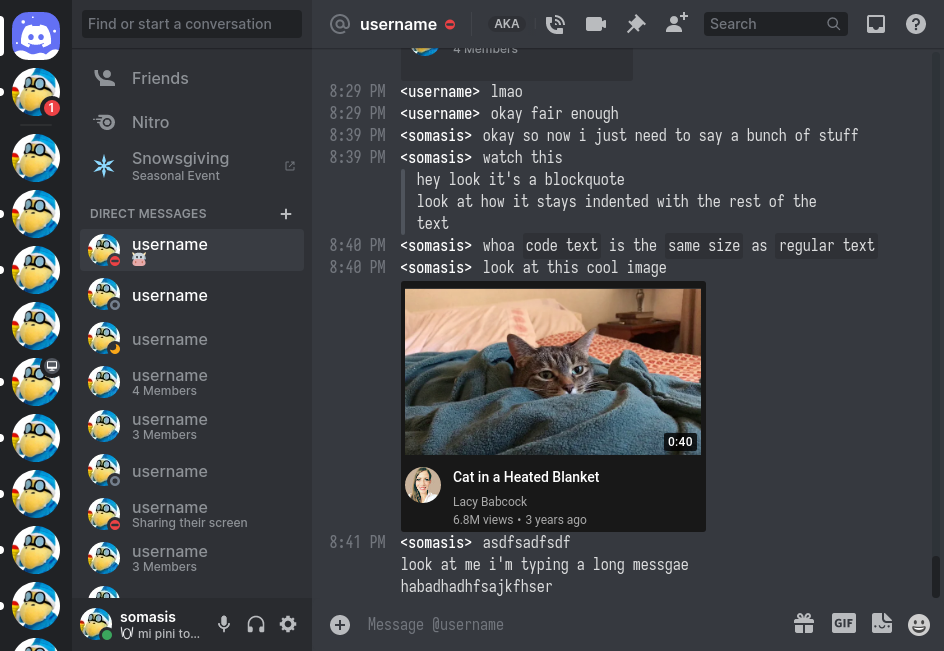

= discord-theme-irc
:lang: en-US

It makes Discord look more like an IRC client.

Monospace text is used for the conversation view, and usernames are bracketed akin to the
traditional style used in many IRC clients.
Timestamps are always shown and emojis are made jumbo as in Cozy mode; the text entry now blends
into the conversation view, akin to the appearance of typing into a terminal.

Whenever possible, these changes only apply in Compact mode.

== Usage

Clone this repository into your Powercord themes directory (it can be opened from the client).

.Unix-like systems
[literal]
$ cd "${XDG_DATA_HOME:-$HOME/.local/share}"/powercord/themes
$ git clone https://git.mutiny.red/somasis/discord-theme-irc
# -or-
$ git clone https://github.com/somasis/discord-theme-irc

Then load missing themes in Powercord, or restart it, if it's running.

Make sure the theme is enabled in the theme section of Powercord's settings (or rather, the
https://github.com/redstonekasi/theme-toggler[Theme Toggler]'s theme section).

Then, the theme should apply.
